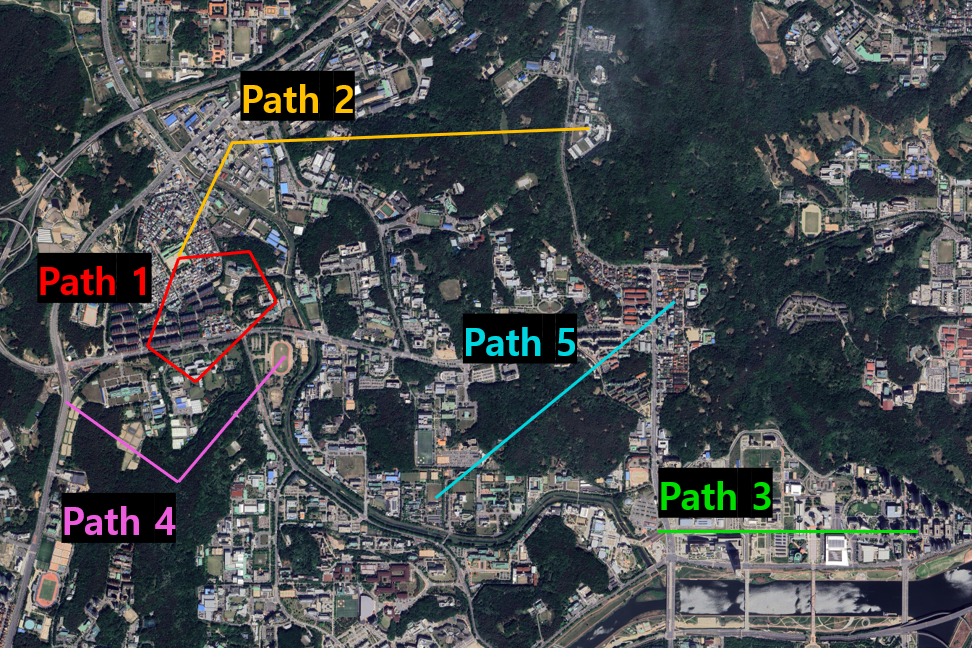

# KoSim-GL: Korean Simulation-based Geo-Localization Benchmark

**KoSim-GL** is a large-scale cross-view geo-localization benchmark dataset
constructed using an AirSim and ROS-based drone flight simulator.
To the best of our knowledge, KoSim-GL is the first geo-localization benchmark
targeting Korean urban environments, comprising 2,450,315 drone images and
1,704 satellite images across 284 locations in Sinseong-dong, Daejeon,
Republic of Korea.

---

## Highlights

- **First** cross-view geo-localization benchmark targeting Korean urban environments
- **5-Camera Multi-View Platform**: 1 Nadir + 4 directional Oblique views captured simultaneously
- **Multiple Altitudes**: 100m–600m (6 levels at 100m intervals)
- **Multiple Scenes**: High-rise apartments, low-rise residential areas, mountainous terrain, research institutes, educational facilities, and more
- **Contiguous Area** coverage with **Arbitrary Free-Path** drone positions
- **Multi-Scale Satellite Images** providing altitude-matched patch sets
- Compatible with **University-1652 format**

---

## Dataset Statistics

| Split | Locations | Drone Images | Satellite Images |
|-------|-----------|-------------|-----------------|
| Train | 255 | 2,188,425 | 1,530 |
| Test | 29 | 261,890 | 174 |
| **Total** | **284** | **2,450,315** | **1,704** |

---

## Comparison with Existing Benchmarks

| | University-1652 | SUES-200 | DenseUAV | UAV-VisLoc | GTA-UAV | **KoSim-GL (Ours)** |
|---|---|---|---|---|---|---|
| **Drone images** | 37,854 | 24,210 | 18,198 | 6,742 | 33,763 | **2,450,315** |
| **Drone-view GPS locations** | Aligned | Aligned | Aligned | — | Arbitrary | **Arbitrary** |
| **Altitude range** | 121.5–256m | 150–300m | 80–100m | 400–2,000m | 80–650m | **100–600m** |
| **Contiguous area** | ✗ | ✗ | ✓ | ✓ | ✓ | **✓** |
| **Multiple altitudes** | ✓ | ✗ | ✗ | ✗ | ✓ | **✓** |
| **Multiple scenes** | ✗ | ✗ | ✗ | ✓ | ✓ | **✓** |
| **Multi-scale satellite images** | ✗ | ✗ | ✗ | — | ✓ | **✓** |
| **Multi-view support** | 1 oblique | 1 oblique | 1 nadir | 1 nadir | 1 nadir | **5 views (1 nadir + 4 oblique)** |

---

## Data Collection Details

- **Simulator**: AirSim + ROS
- **Location**: Sinseong-dong, Doryong-dong, and Gajeong-dong, Daejeon, Republic of Korea
- **Flight Paths**: 5 distinct paths (Path 1–5), each flown at 6 altitudes
- **Satellite Imagery**: Google Maps Tile API (Zoom Level 17, ~0.96 m/pixel at latitude 36.35°N)
- **Camera Resolution**: 640×480, FOV 30°
- **Drone Speed**: 3 m/s

### Camera Configuration

| Camera | Position | Orientation |
|--------|----------|-------------|
| Center CAM | Drone body center | 90° nadir-facing (directly downward) |
| Front / Back / Left / Right CAM | 1m from center along each axis | 25° from horizontal (oblique) |

### Flight Paths



| Path | Distance | Key Locations |
|------|----------|---------------|
| Path 1 | 2.280 km | Geumseong Elementary School → Lucky Hana Apartment → Hanwha Solutions Central Research Institute → Korea Research Institute of Chemical Technology |
| Path 2 | 2.593 km | Geumseong Elementary School → Hanwoo Kimsatgat → Samyang Group R&D Center |
| Path 3 | 1.380 km | National Science Museum → TJB Daejeon Broadcasting |
| Path 4 | 1.679 km | Sinseong Crossroads → Sinseong Neighborhood Park (Mountain) → Daedeok Research Complex Sports Complex |
| Path 5 | 1.780 km | International Intellectual Property Training Institute → Daedeok High School |

---

## Baseline Performance

### Single-View

| Method | R@1 | R@5 | R@10 | AP |
|--------|-----|-----|------|----|
| MuseNet (PR'24) | 40.68 | 86.24 | 95.27 | 26.08 |
| DWDR (TGRS'24) | 41.11 | 88.18 | 97.14 | 27.71 |
| LPN (TCSVT'22) | 42.74 | 85.49 | 97.60 | 29.00 |
| FSRA (TCSVT'21) | **44.08** | 88.17 | 97.94 | 29.13 |
| CVCities (JSTARS'24) | 37.97 | 82.62 | 90.55 | 18.65 |
| MCCG (TCSVT'24) | 42.52 | **91.15** | **98.22** | 27.91 |
| Sample4Geo (ICCV'23) | 35.53 | 82.05 | 91.14 | 20.43 |
| DAC (TCSVT'24) | 37.11 | 84.82 | 89.38 | 19.42 |
| CAMP (TGRS'24) | 36.26 | 84.16 | 93.13 | 19.64 |
| MFRGN (ACM MM'24) | 38.02 | 74.37 | 86.35 | **20.82** |

### Multi-View

| Method | R@1 | R@5 | R@10 | AP |
|--------|-----|-----|------|----|
| MuseNet (PR'24) | 64.93 | 95.75 | 99.54 | 36.89 |
| DWDR (TGRS'24) | 60.38 | 91.95 | 98.86 | **38.08** |
| LPN (TCSVT'22) | 62.90 | 95.64 | **99.63** | 37.34 |
| FSRA (TCSVT'21) | **65.37** | 95.94 | **99.63** | 37.49 |
| CVCities (JSTARS'24) | 45.64 | 90.76 | 97.28 | 25.44 |
| MCCG (TCSVT'24) | 56.18 | **96.32** | 99.21 | 32.54 |
| Sample4Geo (ICCV'23) | 44.67 | 89.64 | 95.57 | 24.41 |
| DAC (TCSVT'24) | 45.48 | 91.59 | 99.28 | 25.90 |
| CAMP (TGRS'24) | 48.19 | 92.47 | 96.76 | 23.61 |
| MFRGN (ACM MM'24) | 44.87 | 89.77 | 93.82 | 25.04 |

> The highest single-view R@1 of 44.08% (FSRA) is substantially lower than performance on existing benchmarks
> such as University-1652 (60–80%), confirming that KoSim-GL presents a higher level of difficulty.
> Multi-view fusion significantly improves R@1 up to 65.37%, demonstrating the value of the 5-camera platform.

---

## Download

The dataset is available for download via Google Drive.

| Split | Drone Images | Satellite Images | Link |
|-------|-------------|-----------------|------|
| Full Dataset | 2,450,315 | 1,704 | [Google Drive](https://drive.google.com/file/d/1ETqNb3wSZi64bmX2KV-hp4E9-CfCU8TZ/view?usp=drive_link) |

> The full dataset includes both train and test splits in University-1652 format.

---

## Citation

If you use KoSim-GL in your research, please cite our paper:
```bibtex
@article{ahn2026kosimgl,
  title   = {KoSim-GL: Korean Simulation-based Geo-Localization Benchmark},
  author  = {Ahn, Heejin and Lee, Changhwan and Lee, Sangwook and
             Seo, Minseok and Wi, HyeonJoong and Jang, Insung and
             Choi, Dong-geol},
  journal = {Electronics},
  publisher = {MDPI},
  year    = {2026}
}
```

---

## License

This dataset is licensed under the
**Creative Commons Attribution-NonCommercial 4.0 International (CC BY-NC 4.0)** license.

- Free to use, modify, and redistribute for research and non-commercial purposes
- Attribution to the original authors is required
- Commercial use is not permitted

[](https://creativecommons.org/licenses/by-nc/4.0/)

---

## Contact

For any questions or issues, please open an [Issue](../../issues) in this repository.
